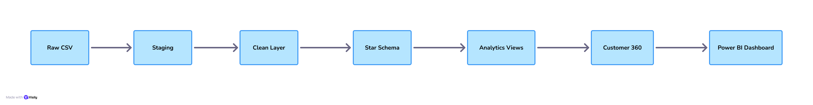
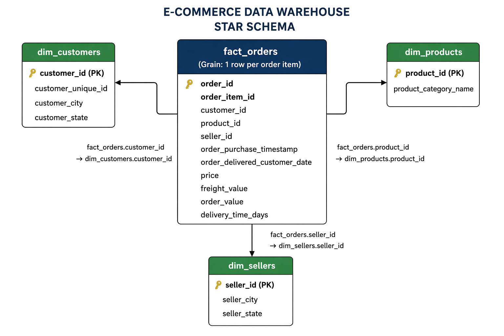

#  Customer 360 + Revenue Intelligence System

##  Problem Statement

E-commerce companies often struggle to understand customer behavior, retention, and revenue trends due to fragmented transactional data.

This project builds a centralized analytics system that transforms raw data into actionable insights, enabling:

* Customer value tracking
* Churn detection
* Revenue analysis

---

##  Dataset

* **Source:** Olist Brazilian E-commerce Dataset
* **Records:** ~100,000+ orders
* **Time Range:** 2016–2018

> Note: Churn is calculated relative to the dataset’s latest timestamp, not the current system date.

---

##  Architecture

---

##  Data Model

### Fact Table

* **fact_orders**

  * Grain: 1 row per order item
  * Contains: price, freight, order value, delivery time

### Dimension Tables

* **dim_customers** → customer details
* **dim_products** → product information
* **dim_sellers** → seller information

---

## 🗺️ Schema Diagram

---

##  Key Features

* Customer Lifetime Value (CLV)
* Monthly Revenue Analysis
* Repeat Purchase Rate
* Average Order Value (AOV)
* RFM Segmentation (Recency, Frequency, Monetary)
* Cohort Retention Analysis
* Churn Detection (90-day inactivity logic)
* Final `customer_360_view`

---

##  Power BI Dashboard

Planned dashboards:

### 1. Revenue Overview

* Monthly revenue trend
* Total revenue
* Average order value

### 2. Customer Analysis

* CLV distribution
* Repeat vs one-time customers
* Churn rate

### 3. Cohort Retention

* Retention heatmap (cohort vs time)

### 4. RFM Segmentation

* High-value vs low-value customers

---

##  Key Insights

### 1. High Customer Churn

A large percentage of customers do not return after their first purchase, indicating weak retention.

### 2. One-Time Buyers Dominate

Most customers place only one order, highlighting opportunity for loyalty programs.

### 3. Revenue Concentration

A small segment of customers contributes a large portion of total revenue (Pareto principle).

### 4. Revenue Trends

Monthly revenue shows growth with fluctuations, suggesting seasonal demand patterns.

### 5. Delivery Impact

Longer delivery times may contribute to increased churn risk.

---

##  Tech Stack

* MySQL
* SQL (Joins, Aggregations, Window Functions)
* Power BI (Dashboarding)

---

##  Final Output

The core analytical output:

### `customer_360_view`

Provides:

* Total orders
* Total revenue
* Last purchase date
* Churn flag
* RFM metrics

---

##  Future Improvements

* Build interactive Power BI dashboard
* Add predictive churn modeling (Machine Learning)
* Automate pipeline (ETL tools like Airflow)

